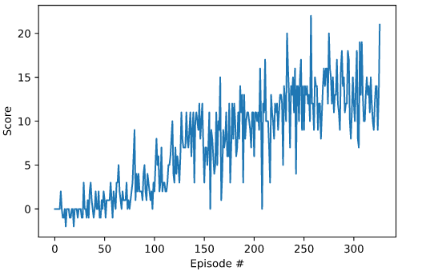

# Project 1 Report

## Learning Algorithm
For the learning algorithm I used the basic version of the DQN.  This included a replay buffer to sample from to overcome correlation issues with successive steps and two separate but identical neural networks where the network weights of the target network are updated more slowly providing fixed Q targets.  I experimented with updating network target weights every 1000 learning steps versus the soft update method and found the soft update method solved the environment more quickly, in 326 episodes as opposed to 499 episodes.    

#### DQN Neural Network Architecture
- fc1 - 64 units, relu activation
- fc2 - 64 units, relu activation
- fc3 - 64 units, relu activation
- fc4 - output layer with 4 action values
- loss - MSELoss
- optimizer - RMSProp

#### DQN Hyperparameters
- gamma = 0.99
- lr = 0.0001
- epsilon_start = 1
- epsilon_min = 0.1
- epsilon_decay = 0.99
- buffer_size = 50000
- batch_size = 32
- update_frequency = 4
- soft_update = True
- tau = 0.001

## Score
### DQN
Enviroment solved in 326 episodes.   

## Ideas for future work
- Double DQN 
- Prioritized experience replay
- Distributed DQN
- Noisy DQN
