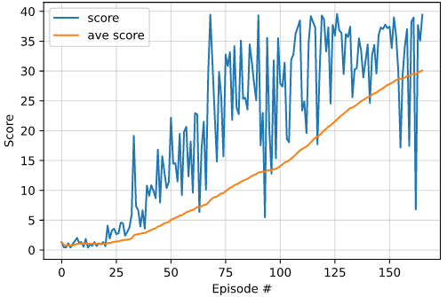

# Project 2 Continuous Control Report  
For this project I used an Actor-Critic method, Deep Deterministic Policy Gradient (DDPG), to solve a continuous control problem.  Specifically I solved the single agent [Reacher](https://github.com/Unity-Technologies/ml-agents/blob/master/docs/Learning-Environment-Examples.md#reacher) environment.  The enviroment is considered solved if the agent achieves a score of 30 or higher averaged over 100 consecutive episodes.   

## The Environment
The environment consists of a double-jointed arm that can move to target locations.  The goal is to keep the hand on the end of the arm in contact with a sphere, i.e. maintain the hand position at the target location for as long as possible.  A reward of +0.1 is given for each step the agent's hand is in the goal location.  The observation space consists of 33 variables that report position, rotation, velocity and angular velocities of the arm.  The action space is a vector of 4 numbers corresponding to the torque applied to the two joints with each number having a range of -1 to 1.   

## DDPG
DDPG uses and actor-critic network to learn policies in high dimensional, continuous spaces.  The actor network is a policy based learning network that is used to approximate the optimal policy determistically, outputting the best believed action for any given state by directly estimating the optimal policy.  The critic network is a value based learning network that learns to evaluate the optimal action value function by using the actors best believed action.  Like DQN, DDPG uses a replay buffer to sample from.  DDPG uses a soft update strategy for the target networks to slowly blend the regular network weights with the target network weights.  DDPG also uses the Ornstein-Uhlenbeck process to add temporally correlated noise at each timestep to help with exploration.   

## Implementation
My implementation uses an adapted version of [ddpg-bipedal](https://github.com/udacity/deep-reinforcement-learning/tree/master/ddpg-bipedal) with updates inspired by the paper [Continuous Control With Deep Reinforcement Learning](https://arxiv.org/pdf/1509.02971.pdf).   

### Actor Network
- Input layer:  33
- Hidden layer: 256
- Hidden layer: 256
- Output layer: 4

### Critic Network
- Input layer:  33
- Hidden layer: 256
- Hidden layer: 256
- Output layer: 1

### Hyperparameters
- Replay buffer size: 1e6
- Batch size: 128
- Gamma: 0.99
- Tau: 1e-3
- Actor learn rate: 1e-3
- Critic learn rate: 1e-3
- L2 weight decay: 0
- Learning interval (timesteps): 20
- Number of learning updates: 10

Per the paper mentioned above I added batch normalization to both the actor and critic network which improved training.  I did not change the activation functions which were relu, relu, tanh for the actor network.  As detailed in lecture '6. Benchmark Implementation' I also added gradient clipping for the critic network and network updates at every 20 timesteps and updating the network 10 times.   

## Training and Results
My implementation was able to solve the environment in 166 timesteps.   
    

## Future Improvements
- Fine tune the hyperparameters 
- Add prioritized experience replay
- Add a noise decay strategy
- Try other policy gradient algorithms like PPO and D4PG
