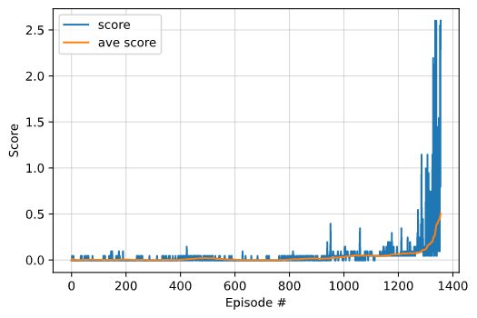

# Project 3 Collaboration and Competition Report  
For this project I used an Actor-Critic method, Deep Deterministic Policy Gradient (DDPG), to solve a multi agent problem.  Specifically I solved the [Tennis](https://github.com/Unity-Technologies/ml-agents/blob/main/docs/Learning-Environment-Examples.md#tennis) environment.  The enviroment is considered solved when an agent achieves a score of 0.5 or higher averaged over 100 consecutive episodes.   

## The Environment
Two agents each control a racket that bounces a ball over a net.  If an agent hits the ball over the net it receives a reward of +0.1.  If an agent lets a ball hit the ground or hits the ball out of bounds it receives a reward of -0.01. The goal of each agent is to keep the ball in play.  The observation space consists of 8 variables corresponding to position and velocity of the ball and racket.  The action space consists of two continuous actions, moving towards or away from the net and jumping.  

## DDPG
DDPG uses and actor-critic network to learn policies in high dimensional, continuous spaces.  The actor network is a policy based learning network that is used to approximate the optimal policy determistically, outputting the best believed action for any given state by directly estimating the optimal policy.  The critic network is a value based learning network that learns to evaluate the optimal action value function by using the actors best believed action.  Like DQN, DDPG uses a replay buffer to sample from.  DDPG uses a soft update strategy for the target networks to slowly blend the regular network weights with the target network weights.  DDPG also uses the Ornstein-Uhlenbeck process to add temporally correlated noise at each timestep to help with exploration.   

For multi agent DDPG each agent has there own actor critic networks and they share a replay buffer.   

## Implementation
For this project I resused my DDPG agent and model from project 2, continuous control.  Details for that are immediatly below.  

My implementation uses an adapted version of [ddpg-bipedal](https://github.com/udacity/deep-reinforcement-learning/tree/master/ddpg-bipedal) with updates inspired by the paper [Continuous Control With Deep Reinforcement Learning](https://arxiv.org/pdf/1509.02971.pdf).   

### Actor Network
- Input layer:  33
- Hidden layer: 256
- Hidden layer: 256
- Output layer: 4

### Critic Network
- Input layer:  33
- Hidden layer: 256
- Hidden layer: 256
- Output layer: 1

### Hyperparameters
- Replay buffer size: 1e6
- Batch size: 128
- Gamma: 0.99
- Tau: 1e-3
- Actor learn rate: 1e-3
- Critic learn rate: 1e-3
- L2 weight decay: 0
- Learning interval (timesteps): 20
- Number of learning updates: 10

Per the paper mentioned above I added batch normalization to both the actor and critic network which improved training.  I did not change the activation functions which were relu, relu, tanh for the actor network.  As detailed in lecture '6. Benchmark Implementation' I also added gradient clipping for the critic network and network updates at every 20 timesteps and updating the network 10 times.   

To adapt my original ddpg agent as a multi agent, step, act and reset methods were implemented in another class, MultiAgent. On init MultiAgent instantiates the specified number of ddpg agents.  The step, act and reset methods will perform the necessary actions for all the individual agent.  

## Training and Results
My implementation was able to solve the environment in 1356 timesteps.   
    

## Future Improvements
- Fine tune the hyperparameters 
- Add prioritized experience replay
- Add a noise decay strategy
- Try other policy gradient algorithms like PPO and D4PG
